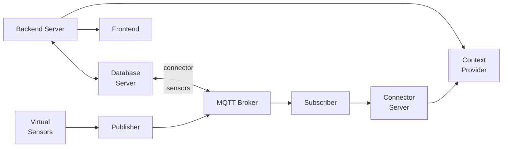

```mermaid 

graph LR; 

database["Database\n Server"]
backend["Backend Server"]
frontend["Frontend"]
connector["Connector\n Server"]
sub["Subscriber"]
pub["Publisher"]
virtual["Virtual\n Sensors"]
cp["Context\n Provider"]
broker["MQTT Broker"]

backend --> frontend

backend <--> database
backend --> cp

connector --> cp 
database <-- connector  

sensors --> broker
virtual --> pub 
pub --> broker 

broker --> sub 
sub --> connector 

```

