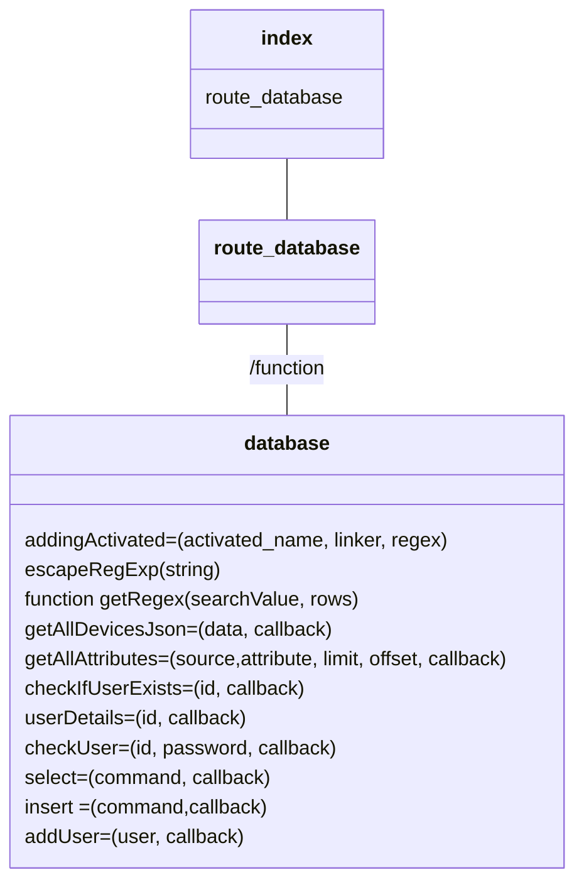

```mermaid
classDiagram

database : addingActivated=(activated_name, linker, regex)
database : escapeRegExp(string)
database : function getRegex(searchValue, rows)
database : getAllDevicesJson= (data,  callback)
database : getAllAttributes=(source,attribute, limit, offset, callback)
database : checkIfUserExists= (id, callback)
database : userDetails= (id, callback)
database : checkUser= (id, password, callback)
database : select=(command, callback)
database : insert = (command,callback) 
database : addUser= (user, callback)

index : route_database
index -- route_database

route_database -- database : /function


```
