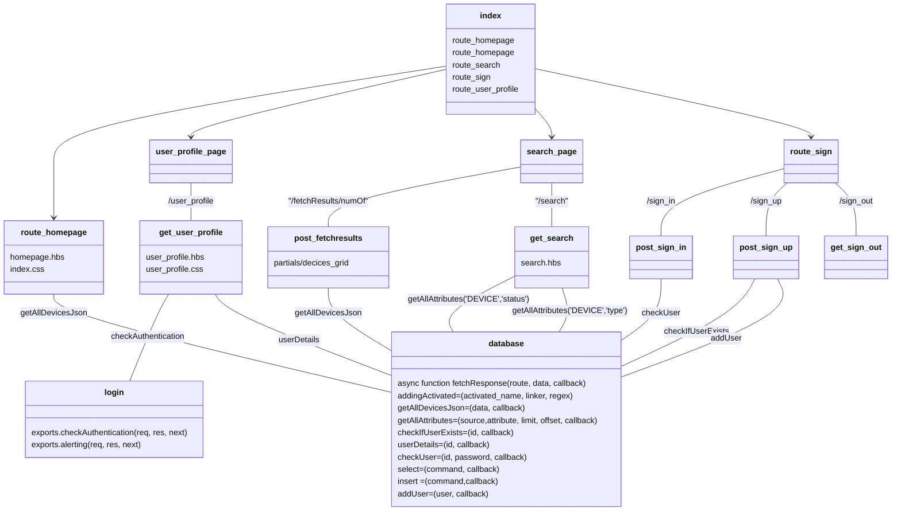

```mermaid
classDiagram

%% Index page %%

index : route_homepage 
index : route_homepage
index : route_search
index : route_sign
index : route_user_profile

index --> route_homepage
index --> user_profile_page 
index --> search_page 
index --> route_sign


%% Controllers   %%

database: async function fetchResponse(route, data, callback)
database: addingActivated=(activated_name, linker, regex)
database: getAllDevicesJson= (data,  callback)     
database: getAllAttributes=(source,attribute, limit, offset, callback)
database: checkIfUserExists= (id, callback) 
database: userDetails= (id, callback) 
database: checkUser= (id, password, callback) 
database: select=(command, callback) 
database: insert = (command,callback) 
database: addUser= (user, callback) 

login: exports.checkAuthentication (req, res, next)
login: exports.alerting (req, res, next)

%% Routes  %%

route_homepage -- database : getAllDevicesJson

route_homepage: homepage.hbs
route_homepage: index.css


search_page -- post_fetchresults: "/fetchResults/numOf"
post_fetchresults -- database : getAllDevicesJson
post_fetchresults : partials/decices_grid


search_page -- get_search: "/search"
get_search -- database : getAllAttributes('DEVICE','status')
get_search -- database : getAllAttributes('DEVICE','type')

get_search: search.hbs 


user_profile_page -- get_user_profile: /user_profile

get_user_profile -- login : checkAuthentication
get_user_profile -- database: userDetails

get_user_profile: user_profile.hbs
get_user_profile: user_profile.css


route_sign -- post_sign_in: /sign_in
route_sign -- post_sign_up: /sign_up
route_sign -- get_sign_out: /sign_out

post_sign_in -- database: checkUser


post_sign_up -- database: checkIfUserExists
post_sign_up -- database: addUser


```