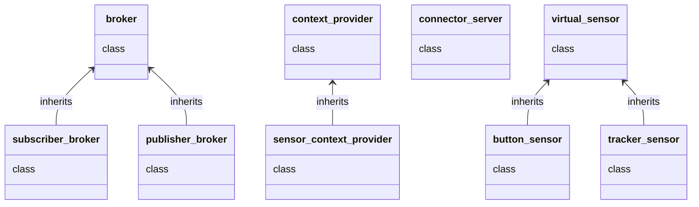
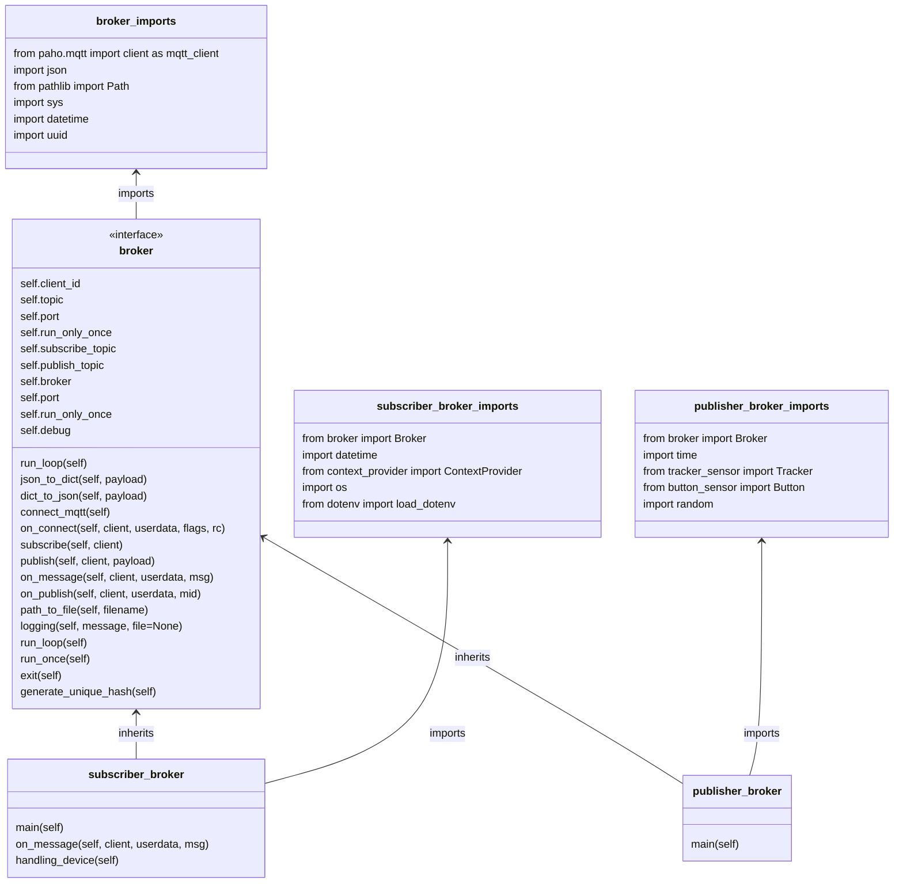

## Inheritance 

```mermaid
classDiagram 

broker: class 
broker <-- subscriber_broker : inherits
broker <-- publisher_broker : inherits

subscriber_broker : class 
publisher_broker : class 

context_provider : class
context_provider <-- sensor_context_provider : inherits
sensor_context_provider : class

connector_server : class 

virtual_sensor : class 

virtual_sensor <-- button_sensor : inherits 
virtual_sensor <-- tracker_sensor : inherits 

button_sensor : class 
tracker_sensor : class 


```

## Functions

```mermaid
classDiagram 

class broker 
<<interface>> broker

broker <-- subscriber_broker : inherits
broker <-- publisher_broker : inherits

broker_imports : from paho.mqtt import client as mqtt_client
broker_imports : import json
broker_imports : from pathlib import Path
broker_imports : import sys
broker_imports : import datetime
broker_imports : import uuid

broker_imports <-- broker: imports

subscriber_broker_imports : from broker import Broker
subscriber_broker_imports : import datetime
subscriber_broker_imports : from context_provider import ContextProvider
subscriber_broker_imports : import os
subscriber_broker_imports : from dotenv import load_dotenv

subscriber_broker_imports <-- subscriber_broker : imports


publisher_broker_imports : from broker import Broker
publisher_broker_imports : import time
publisher_broker_imports : from tracker_sensor import Tracker
publisher_broker_imports : from button_sensor import Button
publisher_broker_imports : import random
publisher_broker_imports <-- publisher_broker : imports 


broker : self.client_id
broker : self.topic
broker : self.port
broker : self.run_only_once
broker : self.subscribe_topic
broker : self.publish_topic
broker : self.broker
broker : self.port
broker : self.run_only_once
broker : self.debug

broker : run_loop(self)
broker : json_to_dict(self, payload)
broker : dict_to_json(self, payload)
broker : connect_mqtt(self)
broker : on_connect(self, client, userdata, flags, rc)
broker : subscribe(self, client)
broker : publish(self, client, payload)
broker : on_message(self, client, userdata, msg)
broker : on_publish(self, client, userdata, mid)
broker : path_to_file(self, filename)
broker : logging(self, message, file=None)
broker : run_loop(self)
broker : run_once(self)
broker : exit(self)
broker : generate_unique_hash(self)

publisher_broker: main(self)

subscriber_broker : main(self)
subscriber_broker : on_message(self, client, userdata, msg)
subscriber_broker : handling_device(self)
```

