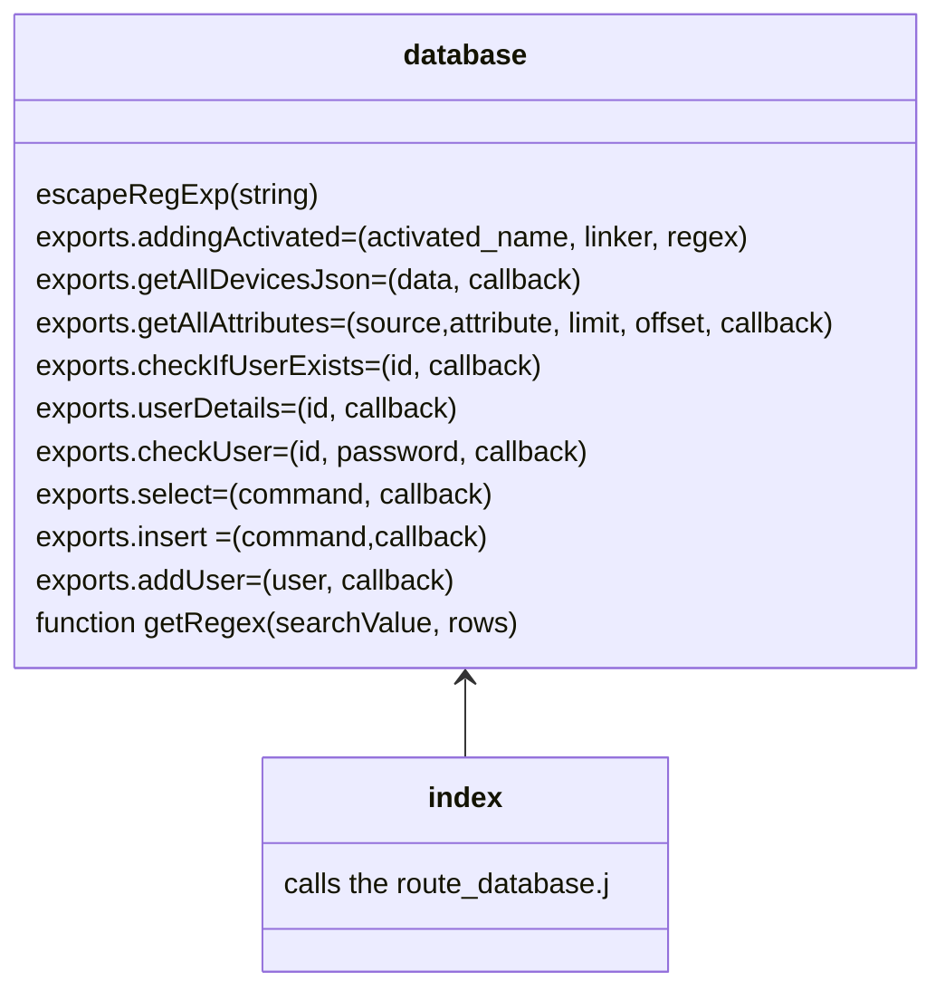

```
database_server
├── controllers
│   └── database.js
│        └── Functions that communicate with the sqlite file
├── docs
│   └── some documentation
├── index.js
│   └── Starts the database server 
├── model
│   └── Files for creating the database 
└── routes
    └── route_database.js
        ├── route_device_info.js
            └── Contains all the routes used by the connector_server.py 
```




	 


