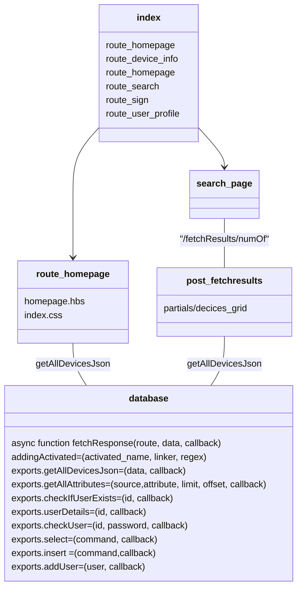

```
website
├── controllers
│   ├── c_search.js
│   ├── database.js
│   ├── helpers.js
│   └── login.js
├── docs
│   └── index.md
├── index.js
├── model
│   └── sessions
│       ├── random.txt
│       └── session.sqlite
├── public
│   ├── css
│   ├── img
│   └── javascript
│       ├── alerting.js
│       ├── filters.js
│       ├── map.js
│       ├── searchbar.js
│       ├── search_page.js
│       ├── show_pages.js
│       ├── sign_in.js
│       └── user_profile.js
├── routes
│   ├── route_about.js
│   ├── route_device_info.js
│   ├── route_homepage.js
│   ├── route_search.js
│   ├── route_sign.js
│   └── route_user_profile.js
└── views
    ├── about.hbs
    ├── book_info_og.hbs
    ├── device_info.hbs
    ├── homepage.hbs
    ├── layouts
    │   └── main.hbs
    ├── partials
    │   ├── card copy.hbs
    │   ├── card.hbs
    │   ├── deviceHistoryList.hbs
    │   ├── device_placement.hbs
    │   ├── devices_grid.hbs
    │   ├── filterCategories.hbs
    │   ├── footer.hbs
    │   ├── header.hbs
    │   ├── info_grid.hbs
    │   ├── map.hbs
    │   ├── membershipCard.hbs
    │   ├── profile_picture.hbs
    │   ├── searchbar.hbs
    │   ├── sign_in_up.hbs
    │   └── timeline.hbs
    ├── print_list.hbs
    ├── search.hbs
    └── user_profile.hbs
```



