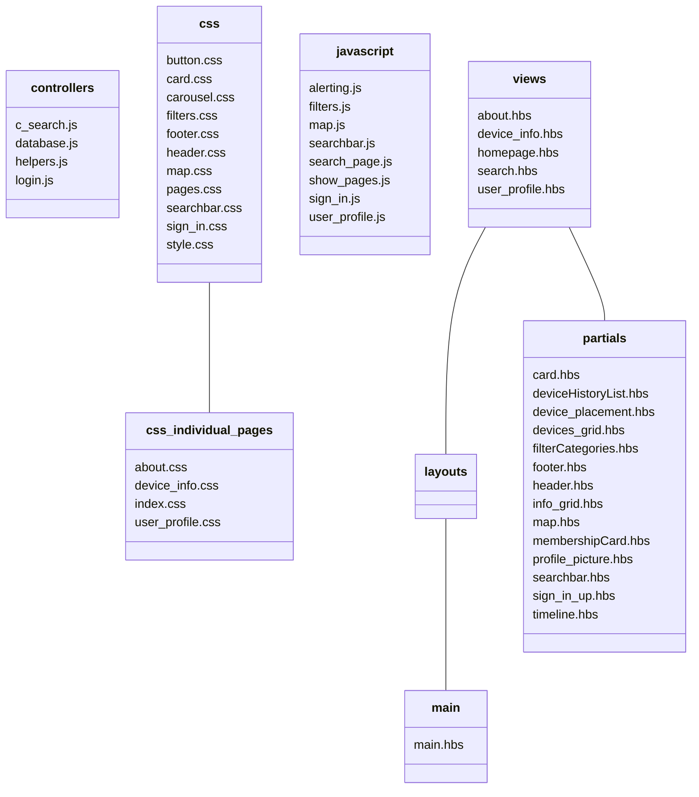
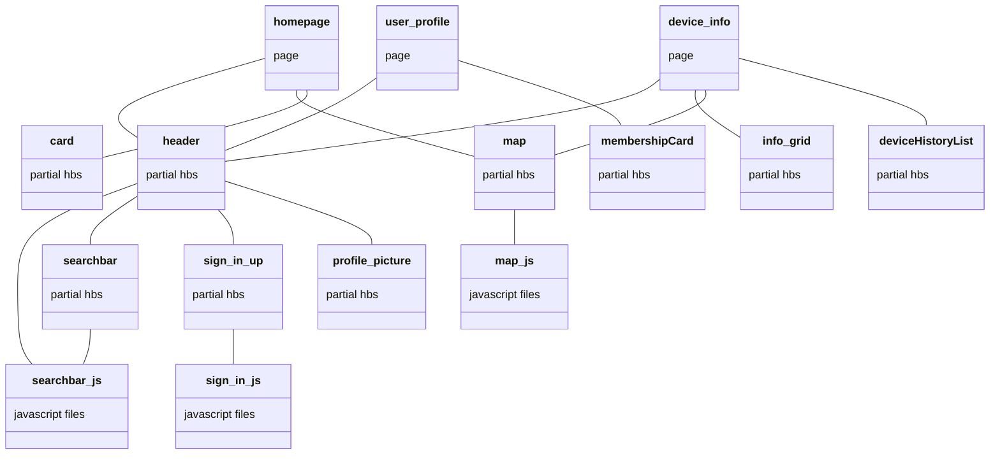
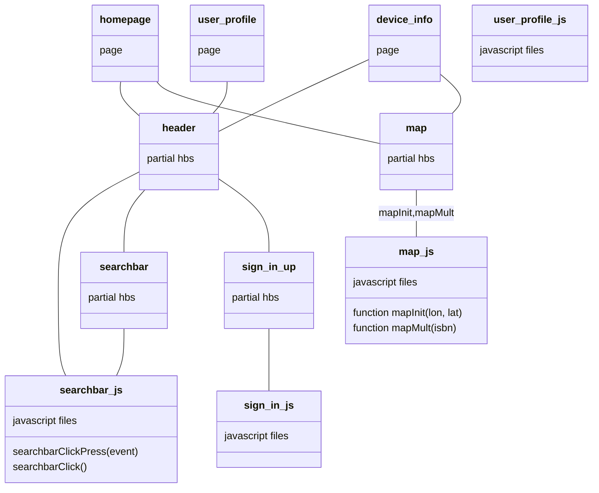

## Folders and files 

```mermaid
classDiagram 


%% Controllers  %%

controllers : c_search.js
controllers : database.js
controllers : helpers.js
controllers : login.js

%% Public   %%

%% CSS   %%

css : button.css
css : card.css
css : carousel.css
css : filters.css
css : footer.css
css : header.css
css : map.css
css : pages.css
css : searchbar.css
css : sign_in.css
css : style.css

css -- css_individual_pages 
css_individual_pages : about.css
css_individual_pages : device_info.css
css_individual_pages : index.css
css_individual_pages : user_profile.css

%% javascript : %%

javascript : alerting.js
javascript : filters.js
javascript : map.js
javascript : searchbar.js
javascript : search_page.js
javascript : show_pages.js
javascript : sign_in.js
javascript : user_profile.js


%% Views  %%

views : about.hbs
views : device_info.hbs
views : homepage.hbs
views : search.hbs
views : user_profile.hbs

%% Layouts %%

views -- layouts 
layouts -- main
main: main.hbs

%% Partials  %%

views -- partials
partials : card.hbs
partials : deviceHistoryList.hbs
partials : device_placement.hbs
partials : devices_grid.hbs
partials : filterCategories.hbs
partials : footer.hbs
partials : header.hbs
partials : info_grid.hbs
partials : map.hbs
partials : membershipCard.hbs
partials : profile_picture.hbs
partials : searchbar.hbs
partials : sign_in_up.hbs
partials : timeline.hbs

```

## Connections HBS 

```mermaid
classDiagram 

homepage: page
device_info : page
user_profile: page 

searchbar: partial hbs
sign_in_up: partial hbs
header: partial hbs
card : partial hbs
map : partial hbs
info_grid : partial hbs
membershipCard : partial hbs
deviceHistoryList : partial hbs
profile_picture   : partial hbs

searchbar_js : javascript files 
map_js  : javascript files 
sign_in_js : javascript files 

homepage --  header 
homepage --  map 
homepage --  card 

device_info --  header 
device_info --  info_grid 
device_info --  map 
device_info --  deviceHistoryList 

user_profile --  header
user_profile --  membershipCard

header -- searchbar_js
header -- searchbar
header --  sign_in_up
header --  profile_picture


map --  map_js 
searchbar --  searchbar_js 
sign_in_up --  sign_in_js


```

## Connections JS 

```mermaid
classDiagram 

homepage: page
device_info : page
user_profile: page 

searchbar: partial hbs
sign_in_up: partial hbs
header: partial hbs
map : partial hbs

user_profile_js : javascript files 
searchbar_js : javascript files 
map_js  : javascript files 
sign_in_js : javascript files 

homepage --  header 
homepage --  map 


device_info --  header 
device_info --  map 

user_profile --  header

header -- searchbar_js
header -- searchbar
header --  sign_in_up


searchbar --  searchbar_js 
sign_in_up --  sign_in_js


searchbar_js : searchbarClickPress(event)
searchbar_js : searchbarClick()

map --  map_js : mapInit,mapMult

map_js : function mapInit(lon, lat)
map_js : function mapMult(isbn) 

```

