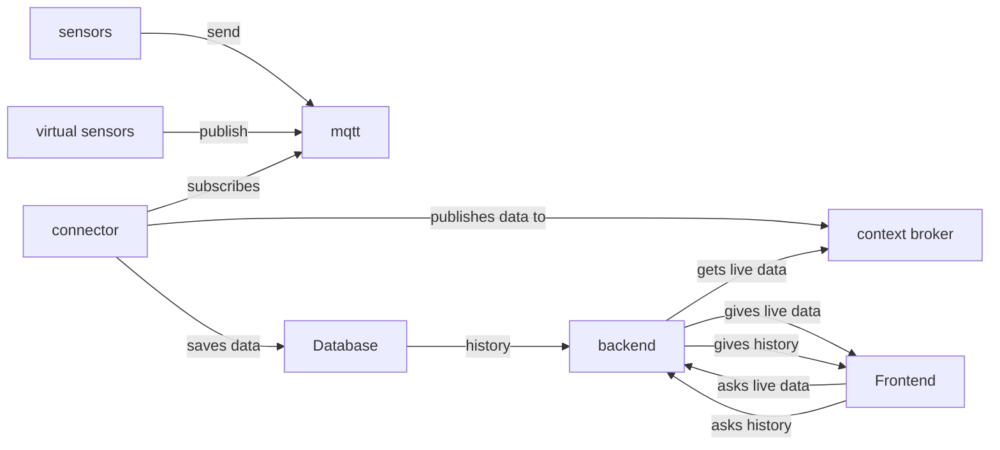
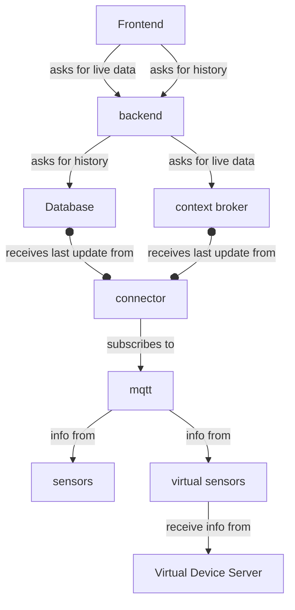

Στον MQTT broker του εργαστηρίου (http://150.140.186.118:1883/, 9001 για mqtt over websockets), με τις συσκευές, προστέθηκε νέο topic path (πέρα από το application_name/device_name) με το πρόθεμα "json/" (δλδ "json/application_name/device_name") όπου τα δεδομένα είναι σε μορφή json string (αντί python dict string που ήταν στα παραδείγματα στην τάξη) για όσους το προτιμούν έτσι. Το παλιό path μένει ως είχε για backwards compatibility με ότι έχετε κάνει έως ώρας. Επιπλέον μπορείτε να χρησιμοποιείτε την http://150.140.186.118:5010/ για να διαγνώσετε αν ο σέρβερ είναι offline (λόγω διακοπής ρεύματος) . Επιπλέον , όπως αναφέρεται και στις διαφάνειες 5B στο eclass , στη διεύθυνση http://150.140.186.118:1026/ λειτουργεί και ο context broker του εργαστηρίου τον οποίο μπορείτε να χρησιμοποιείτε ελεύθερα αν δεν θέλετε να τον σηκώνετε οι ίδιοι. Τέλος στο http://150.140.186.118:1111/ υπάρχει μία από τις κάμερες του εργαστηρίου για να την εντάξετε στα πρότζεκτ που το απαιτούν. Total health-checker: http://150.140.186.118:999/ Καλή χρονιά!

> ο context broker είναι σηκωμένος εκεί αλλά δεν τον έχουμε συνδέσει με τον mqtt broker, απλά υπάρχει. εσείς παίρνοντας δεδομένα από τον mqtt δημιουργείτε ότι οντότητες θέλετε στον context broker.

αισθητηρες -> mqtt 
εμεις κανουμε publish στον mqtt 
μετα πρεπει να τα μεταφερουμε απο το mqtt σε context broker 
εμεις παινρουμε τον context και τον συνδεουμε με τις συσκευες μας

απο mqtt subscribe
και μετα το παει στο context broker στις συσκευες που 

backend get στον context broker 

εκει που συνδεει mqtt με context broker να τα βαζει και στην βαση 

cycnos ειναι ενα component του fiware, ετσι αυτο στελνει notificatonis και βαζει σε βαση 

context broker για την θεση του mpa και ιστορικα δεδομενα απο την βαση που θα γραφουμε εμεις 

Να το δειξουμε πολυ στην αρχιτεκτονικη ! 

με την live ενημερωση του 

Reload την σελιδα στο frontend με το να κανει subscribe στο mqtt 

Ακομα καλυτερα να κοιταει καλυτερα το 

---- 

Individual 

Ο sensor κανει publish τα δεδομενα στον mqtt broker 
O connector μας παιρνει τα δεδομενα απο τον mqtt broker 
Ο connector μας στελνει τα δεδομενα στον context provider για την καθε συσκευη 
Ο connector μας αποθηκευει τα δεδομενα στην βάση για την καθε συσκευη 

----

Διαδικασια Frontend 

